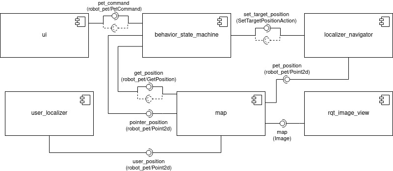
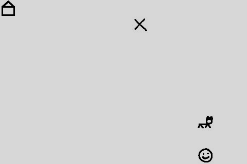
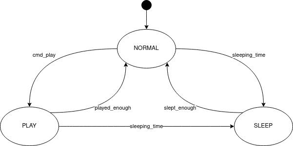

# experimental_robotics_lab1
<!-- PROJECT SHIELDS -->
<!--
*** I'm using markdown "reference style" links for readability.
*** Reference links are enclosed in brackets [ ] instead of parentheses ( ).
*** See the bottom of this document for the declaration of the reference variables
*** for contributors-url, forks-url, etc. This is an optional, concise syntax you may use.
*** https://www.markdownguide.org/basic-syntax/#reference-style-links
-->
[![Contributors][contributors-shield]][contributors-url]
[![Forks][forks-shield]][forks-url]
[![Stargazers][stars-shield]][stars-url]
[![Issues][issues-shield]][issues-url]
[![MIT License][license-shield]][license-url]
[![LinkedIn][linkedin-shield]][linkedin-url]


<!-- PROJECT LOGO -->
<br />
<p align="center">
  <a href="https://github.com/FilipHesse/experimental_robotics_lab1">
    
  </a>

  <h3 align="center">ROBOT_PET</h3>

  <p align="center">
    This repository contains the first assignment of the experimental robotics laboratory course 2020 at the University of Genoa.
    It can be used to play around with ros. It contains only simulations, so no special hardware is needed.
    The doxygen-documantation of the code can be found here:
    <br />
    <a href="https://FilipHesse.github.io/experimental_robotics_lab1"><strong> « « API » » </strong></a>
    <br />
    <br />
    <a href="https://github.com/FilipHesse/experimental_robotics_lab1/issues">Report Bug</a>
    ·
    <a href="https://github.com/FilipHesse/experimental_robotics_lab1/issues">Request Feature</a>
  </p>
</p>


<!-- TABLE OF CONTENTS -->
## Table of Contents

- [experimental_robotics_lab1](#experimental_robotics_lab1)
  - [Table of Contents](#table-of-contents)
  - [About The Project](#about-the-project)
    - [Built With](#built-with)
  - [Software architecture](#software-architecture)
    - [Component Diagram](#component-diagram)
    - [Launchfiles](#launchfiles)
    - [Ros parameters](#ros-parameters)
    - [Messages, services and actions](#messages-services-and-actions)
    - [State Machine](#state-machine)
  - [Packages and file list](#packages-and-file-list)
  - [Getting Started](#getting-started)
    - [Prerequisites](#prerequisites)
    - [Installation](#installation)
  - [Usage](#usage)
  - [Working hypothesis and environment](#working-hypothesis-and-environment)
  - [Systems features](#systems-features)
  - [Systems limitations](#systems-limitations)
  - [Possible technical improvements](#possible-technical-improvements)
  - [License](#license)
  - [Contact](#contact)


<!-- ABOUT THE PROJECT -->
## About The Project

The aim of this assignemt is to get acquainted with building finite state machines
with using smach and designing an appropritate software architecture for the following scenario:
A robot pet (which is simulated in our case) has 3 states: 
* normal: The robot moves around randomly
* play: The robot approaches the person, waits for a position command, goes to that position and comes back to the user
* sleep: The robot returns to the position of a house  and sleeps for some time, then it wakes up and returns to normal

### Built With

* [ROS noetic](http://wiki.ros.org/noetic/Installation)
* [Python3](https://www.python.org/downloads/)
* [Smach](http://wiki.ros.org/smach)

## Software architecture

### Component Diagram


The ros package robot_pet consits of 6 components which are 
* <strong>ui</strong> : 
  * This node is the simulated user interface. It is a service client, that creates commands to simulate the users behavior. The programmer has chosen a service over a publisher, because we want to
  make sure no message gets lost.
  It creates and sends two types of commands:
    1) "play" 0 0 to notify the robot to go to playing mode
    2) "go_to" x y to give the robot a target position.
  * Each fifth command is a play command, the other commands are go_to commands.
  Between two commands, there is always a rondom time passing between 0.5 and 5 seconds.
  * The commands are sent with a random time delay between 0.5 and 5 seconds
  * Requires ROS parameters: 
    * /map_width
    * /map_height
* <strong>behavior_state_machine</strong> :
  * This is the heart of robot_pet package, which defines the robots behavior
  * Contains a finite state machine implemented in smach. The 3 states of the
  robot pet are NORMAL, PLAY and SLEEP. The state diagram can be found below
  * Each interface with the ROS infrastructure, such as service clients,
  servers, action clients and publishers are implemented within separate
  classes. All these interfaces are then passed to the smach-states while they
  are constructed, in order to make the interfaces accessible for the states.
  * Requires ROS parameters: 
    * /map_width
    * /map_height
* <strong>localizer_navigator</strong> :
  * Simple ROS-node, which simulates the robot naviagation. It simulates to localize the robot and navigates to next target point
  *  It contains an action server, that can receive a new target position. The
  server simply waits for some time and considers the position to be reached.
  Then the positions is published to the topic pet_position.
  * The programmer has chosen an action server instead of a service, because the
  action server does not block the client. This way the client can continue
  working while the result of this action is computed.
* <strong>user_localizer</strong> :
  * This node simulates a user moving in the environment. It publishes the new user position at a low frequency of 0.25 Hz. Each time the position is changed, the user has not moved further than one step in x and one step in y.
  * Requires ROS parameters: 
    * /map_width
    * /map_height
    * /user_pos_x
    * /user_pos_y
* <strong>map</strong> :
  * The map node contains all the knowledge about the map itself, which is simply a rectangular grid with integer positions. It contains information about the dimensions of the map and the positions of all objects: pet, user, house, pointer. 
  * The three subscribers subscribe to the variable positions of the objects in
  the map: user, pet, pointer. The server provides the service get_position to the ros environment. The publisher publishes an image of the current map each time the map is updated.
  * Requires ROS parameters: 
    * /map_width
    * /map_height
    * /user_pos_x
    * /user_pos_y
    * /user_house_x
    * /user_house_y
    * /user_pet_x
    * /user_pet_y
* <strong>rqt_image_view</strong> :
  * That node is a built in ROS node, so it has not been implemented in this context. It is used to display the current positions of the actors: House, Pet, User, Pointer
  
  

### Launchfiles

Tho launchfiles are present in the robot_pet package:
* run_system.launch: This file launches all the above nodes with some default 
ROS parameters.
* params.launch: This launchfile only sets default ROS parameters. This enables the user run single nodes, that may require sompe parameters
  
### Ros parameters

Several ROS parameters can be set to modify this software. 
* /map_width: Dimension of rectangular map in x-direction
* /map_height: Dimension of rectangular map in y-direction
* /user_pos_x: Startposition of user: x
* /user_pos_y: Startposition of user: y
* /user_house_x: Startposition of house: x
* /user_house_y: Startposition of house: y
* /user_pet_x: Startposition of pet: x
* /user_pet_y: Startposition of pet: y
  
### Messages, services and actions

The following <strong>ROS-messages</strong> have been defined:
* Point2d.msg: Contains x and y coordinates of a point
```sh
int64 x
int64 y
```
* Point2d.msg: Contains a Point2d and a flag on. The additional flag specifies, if the pointer position should be displayed or not
```sh
robot_pet/Point2d point
bool on
```
The following <strong>ROS-services</strong> have been defined:
* GetPosition.srv: The caller specifies a string ("pet", "user", "house", "pointer") of the object. If the specified object is part of the map, the return value is success = True and the point contains the according coordinates. Else the success flag is False.
```sh
Header header
string object 
---
bool success
robot_pet/Point2d point
```

* PetCommand.srv: A string command ("play", "go_to") can be sent. If the command is "go_to", then a targetpoint should be specified. If the command is "play", the point is ignored.
```sh
Header header
string command 
robot_pet/Point2d point
---
```
The following <strong>ROS-action</strong> has been defined:

* SetTargetPositionAction: This action is used to set a target position of the robot. The caller pecifies a target, which is a Point2d (see above). When the position is reached, the action server confirms the final position by sending back the target point.
```sh
#Goal
robot_pet/Point2d target
---
#Result
robot_pet/Point2d final_position
---
#Feedback
```

### State Machine

The above state diagram shows clearly the three states of the system:
* NORMAL: The robot moves randomly from one position to another. It can transition to the PLAY state by receiving a user command to play. If the sleeping timer triggers sleeping time, then the state transitions to SLEEP.
* SLEEP: The robot approaches the house and stays there, until the sleeping timer triggers, that it's time to wake up (transition "slept_enough"). Then the robot returns to the state NORMAL
* PLAY: The robot performs the following actions in a loop:
  1) Go to user
  2) Wait for a command that specifies a new target
  3) Go to new target
  4) Repeat
  * When a random number of games has been reached, the robot stops playing ("played_enough") and returns to the normal state. When the sleeping timer triggers time to sleep, the state transitions to SLEEP.

## Packages and file list
 The only package in the project, which should be used it the package <strong>robot_pet</strong>. The other packages were all introduced to make the smach_viewer run, which was not successful yet. The smach_viewer is written in python2 while ROS noetic only supports python3. The additional packages still remain inside this repository for the case a solution will be found to make the smach_viewer run.

 The following file tree shows the contents of the robot_pet package. It is located as usual inside catkin_ws/src/:

```sh
robot_pet/
├── action
│   └── SetTargetPosition.action
├── CMakeLists.txt
├── launch
│   ├── params.launch
│   └── run_system.launch
├── msg
│   ├── Point2d.msg
│   └── Point2dOnOff.msg
├── package.xml
├── scripts
│   ├── behavior_state_machine.py
│   ├── images
│   │   ├── house.jpg
│   │   ├── pet.jpg
│   │   ├── pointer.jpg
│   │   └── user.jpg
│   ├── localizer_navigator.py
│   ├── map.py
│   ├── ui.py
│   └── user_localizer.py
└── srv
    ├── GetPosition.srv
    └── PetCommand.srv
```
<!-- GETTING STARTED -->
## Getting Started

To get a local copy up and running follow these simple steps.

### Prerequisites

This package was developed on Ubuntu 20.04, using [ROS noetic](http://wiki.ros.org/noetic/Installation) and [Python3](https://www.python.org/downloads/) (Click on ROS or python for installation instructions)

### Installation

1. Clone the repo
```sh
git clone https://github.com/FilipHesse/experimental_robotics_lab1.git
```

<!-- USAGE EXAMPLES -->
## Usage

To run the project, perform the following steps (from catkin_ws):
1) Source the ros distribution
```sh
source /opt/ros/noetic/setup.bash
```
2) catkin_make the project, so all message files will be created
```sh
catkin_make
```
3) Type
```sh
source devel/setup.bash
```
4) Run the launchfile:
```
roslaunch robot_pet run_system.launch 
``` 

All nodes will startup. One screen will show the output of the map.
rqt_console is also starting up. To understand the robots behavior, it is best to focus on the loginfo messages, that come from the node behavior_state_machine. To do so start the flow of messages and sort the messages according to "Node". Then scroll to the messages, that come from behavior_state_machine. The user can see logs about incoming commands, called actions, state transitions and more. This behavior can simultaniously be compared to the rqt_image_viewer.

Unfortunately the smach_viewer can not be used due to compatibility issues with python3.


## Working hypothesis and environment
The pet is moving in a two dimensional integer domain. The map is just a rectangle, whose size is configured in the ROS parameter server. 
There are no obstacles and no collisions defined, so two objects can have the same position.
The robot will reveive commands even when the robot is moving and process them if they are valid.

## Systems features
The user is not constrained to give commands in a specific order. This is why the user in this implementation gives commands completely independent of the state machines state. A real world user could also say "go_to" while the robot is in the normal mode and the robot should not crash because of that invalid command.
If an invalid command comes in, this is detected and a loginfo message is created: "Invalid command 'go_to' for state NORMAL. First say 'play' and then give go_to commands!"

Setting a new target to the localizer_navigator node is implemented as an action. This prevents the blocking behavior of a service. The state machine is not freezed until the next target is reached. Consequently, the user can give commands any time, the state machine decides when and how to process them.
For example: If the robot hears 'play' in the NORMAL state: Even if the robot is moving at the time of the command, it is received and the state machine waits until the current target is reached and then switches to the state PLAY. So in that state, the robot does not need to stop in order to listen for commands.
The implementation of an action adds a lot of flexibility to the software and keeps it extendable: One could for example use action preemptions (see possible improvements)

## Systems limitations
The user is moving around at a constant rate. This means, even if the pet is aproaching it, the user might move away in the meantime (not far). So in most cases the pet ends up somewhere close to the user, but not at the exact position.

The state PLAY has some limitations:
The state machine only checks if its time to sleep AFTER a game (go to marker once and come back) has been finished. So sometimes the pet goes sleeping a couple of seconds after the sleeping timer has triggered.
When playing the game and the pet goes to the user, it aims to go exactly to the users position. If the person did not move in the meantime, the pet ends up INSIDE of the user, insted in front of it.

The UI is very simplistic and may have undetected weaknesses or bugs. Generally it still fullfills the purpose to visualize what is going on is a vey simple way.

## Possible technical improvements
The state PLAY could be improved: 
The state machine could check more frequently (when going to target, while coming back) if it is time to sleep. Moving actions could then be preempted and the state could be changed immediately. Navigation could also be implemented properly, so that robot stops at an intermediate position, when the "go to target" action is preempted

The project could then be extended im multiple ways, e.g. by implementing obstacles and collisions. For this case it might be usefull tu use simulator tools, such as Stage. 

<!-- LICENSE -->
## License

Distributed under the MIT License. See `LICENSE` for more information.


Project Link: [https://github.com/FilipHesse/experimental_robotics_lab1](https://github.com/FilipHesse/experimental_robotics_lab1)


## Contact

Filip Hesse - S4889393(at)studenti.unige.it


<!-- MARKDOWN LINKS & IMAGES -->
<!-- https://www.markdownguide.org/basic-syntax/#reference-style-links -->
[contributors-shield]: https://img.shields.io/github/contributors/FilipHesse/experimental_robotics_lab1.svg?style=flat-square
[contributors-url]: https://github.com/FilipHesse/experimental_robotics_lab1/graphs/contributors
[forks-shield]: https://img.shields.io/github/forks/FilipHesse/experimental_robotics_lab1.svg?style=flat-square
[forks-url]: https://github.com/FilipHesse/experimental_robotics_lab1/network/members
[stars-shield]: https://img.shields.io/github/stars/FilipHesse/experimental_robotics_lab1.svg?style=flat-square
[stars-url]: https://github.com/FilipHesse/experimental_robotics_lab1/stargazers
[issues-shield]: https://img.shields.io/github/issues/FilipHesse/experimental_robotics_lab1.svg?style=flat-square
[issues-url]: https://github.com/FilipHesse/experimental_robotics_lab1/issues
[license-shield]: https://img.shields.io/github/license/FilipHesse/experimental_robotics_lab1.svg?style=flat-square
[license-url]: https://github.com/FilipHesse/experimental_robotics_lab1/blob/master/LICENSE.txt
[linkedin-shield]: https://img.shields.io/badge/-LinkedIn-black.svg?style=flat-square&logo=linkedin&colorB=555
[linkedin-url]: https://linkedin.com/in/FilipHesse
[product-screenshot]: images/screenshot.png